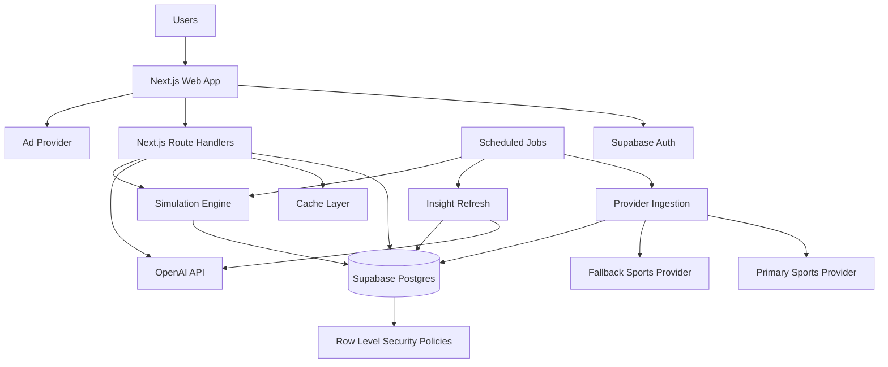

# Architecture

## Architecture principle

All private and mutable operations go through authenticated application routes with RLS enforcement. Public, cacheable reads should be precomputed whenever possible.

## System overview



## Main domains

| Domain | Responsibility | Suggested location |
|---|---|---|
| Auth | Session, profile bootstrap, user context | `lib/auth/*` |
| Groups | Pool creation, invites, memberships, admin settings | `lib/groups/*` |
| Predictions | Bulk upsert, lock enforcement, revision history | `lib/predictions/*` |
| Scoring | Points, snapshots, ranking | `lib/scoring/*` |
| Providers | Vendor abstraction and normalized data | `lib/providers/*` |
| Team pages | Team metric snapshots and summaries | `lib/teams/*` |
| AI insights | Feature payloads, prompt, schema, cache invalidation | `lib/insights/*` |
| Simulator | Match probabilities, group logic, knockout logic | `lib/simulator/*` |
| Ads and consent | Display ads and consent-aware rendering | `components/ads/*` |

## App structure

```text
app/
  (marketing)/
    page.tsx
    pricing/page.tsx
  (app)/
    dashboard/page.tsx
    groups/[groupId]/page.tsx
    matches/[matchId]/page.tsx
    teams/[teamId]/page.tsx
    simulator/page.tsx
    profile/page.tsx
  api/v1/
    groups/route.ts
    groups/[groupId]/route.ts
    groups/[groupId]/join/route.ts
    groups/[groupId]/predictions/route.ts
    groups/[groupId]/leaderboard/route.ts
    matches/[matchId]/insight/route.ts
    teams/[teamId]/route.ts
    simulations/route.ts
    simulations/[simulationId]/route.ts

components/
  groups/
  predictions/
  insights/
  teams/
  simulator/
  ads/
  layout/

lib/
  providers/
  scoring/
  insights/
  simulator/
  auth/
  db/
  cache/
  validators/

supabase/
  migrations/
  functions/
    ingest-fixtures/
    refresh-insights/
    recalc-simulations/
```

## Caching policy

| Surface | Cache rule |
|---|---|
| Marketing pages | Static or long revalidation |
| Team pages | 1–6 hours depending on tournament phase |
| Match detail pre-match | 15–60 minutes |
| Live matches | 5–15 seconds, provider freshness permitting |
| Public simulator | Nightly refresh plus invalidation on major data updates |
| Private group pages | Dynamic, member-only; cache fragments only when safe |

## Background jobs

| Job | Trigger | Responsibility |
|---|---|---|
| Fixture ingestion | Cron and manual admin refresh | Pull provider fixtures and normalize matches |
| Team metric ingestion | Cron | Refresh team rankings, recent form, and snapshots |
| Scoring recalculation | On final match update | Score predictions and update leaderboard snapshots |
| Insight refresh | Scheduled and provider-update triggered | Refresh stale AI match cards |
| Public simulation | Nightly and major data refresh | Generate public tournament probabilities |

## Environment variables

See `templates/env.example`.

Key rules:

- Never expose service role keys client-side.
- Keep provider API keys server-side only.
- Protect cron routes with `CRON_SECRET`.
- Use consent mode for non-essential ads and analytics.
