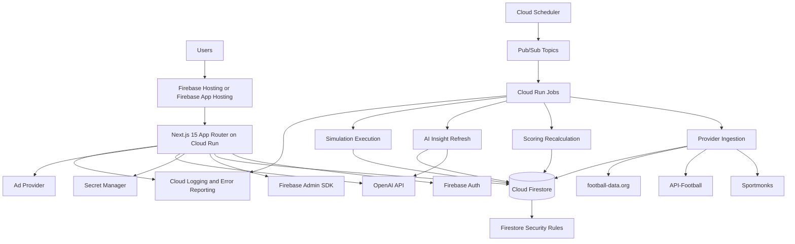

# Architecture

## Architecture Principle

All private and mutable operations go through authenticated application routes running in the Next.js server runtime on Cloud Run. Firestore Security Rules protect client-readable data, but server-side validation remains required for domain rules such as prediction locks, group admin permissions, scoring, AI refreshes, and simulation execution.

Public, cacheable reference data should be precomputed whenever possible.

## System Overview



## Runtime Responsibilities

| Runtime | Responsibility |
|---|---|
| Firebase Hosting or Firebase App Hosting | Public entry point, static assets, routing to the app runtime |
| Cloud Run service | Next.js full-stack runtime, route handlers, SSR, authenticated server validation |
| Cloud Firestore | Primary application database and cached read models |
| Firebase Auth | User authentication and identity |
| Firestore Security Rules | Client access control for public data, user-owned data, and member-readable group data |
| Firebase Admin SDK | Privileged server reads/writes in Cloud Run and Cloud Run Jobs |
| Cloud Run Jobs | Provider ingestion, scoring recalculation, AI refreshes, public simulations, maintenance jobs |
| Cloud Scheduler | Cron triggers for scheduled jobs |
| Pub/Sub | Async event triggers between ingestion, scoring, insight refresh, and simulations |
| Secret Manager | Provider keys, OpenAI key, cron secrets, service secrets |
| Cloud Logging / Error Reporting | App and job observability |

## Data Categories

### Public Cached Reference Data

Examples:

- Competitions
- Seasons
- Teams
- Matches
- Team metric snapshots
- Public match insights
- Public simulation runs
- Ad slot configuration

Rules:

- Readable by clients when safe.
- Written only by trusted server processes.
- Cache aggressively according to freshness needs.
- Include provider IDs and `providerUpdatedAt` where relevant.

### Private Group Data

Examples:

- Group settings
- Members and roles
- Group seasons
- Season-scoped invites
- Group-season leaderboard snapshots
- Group-season prediction visibility and scoring settings

Rules:

- Readable only by active group members.
- Group, member, season, and invite mutations are server-only through validated routes.
- Firestore Security Rules enforce membership checks for direct client reads.
- Server routes still validate role, invite status, and membership state.

### User Predictions

Examples:

- Prediction documents
- Prediction revision documents
- Booster flags
- Save metadata

Rules:

- Users can write only their own predictions.
- Prediction writes must be validated on the server.
- Predictions can be changed only before `lockAt`.
- Bulk saves must be idempotent.
- Revision history must be retained.
- Firestore Security Rules can enforce ownership, but Cloud Run validation must enforce match locks, group settings, booster rules, and prediction shape.

### Background Jobs

Examples:

- Fixture ingestion
- Team metric ingestion
- Final score ingestion
- Scoring recalculation
- AI insight refresh
- Public simulation generation
- Cache invalidation

Rules:

- Run as Cloud Run Jobs.
- Trigger via Cloud Scheduler, Pub/Sub, or manual admin action.
- Use Firebase Admin SDK and Secret Manager.
- Be idempotent.
- Record job metadata, freshness timestamps, and failures.

### AI Insight Generation

Rules:

- Generate only from structured evidence.
- Run in Cloud Run Jobs or protected Cloud Run route handlers.
- Store validated output in Firestore.
- Store model version, prompt version, input hash, provider freshness, generated timestamp, expiry, and invalidation timestamp.
- Reject malformed or unsupported output before rendering.

### Simulator Execution

Rules:

- Public simulations run in Cloud Run Jobs and are cached in Firestore.
- Authenticated custom simulations run through protected Cloud Run route handlers or queued jobs.
- Store model version, assumptions, input hash, run count, generated timestamp, and visibility.
- FIFA World Cup 2026 format logic must be config-driven.

## Main Domains

| Domain | Responsibility | Suggested location |
|---|---|---|
| Auth | Firebase session, profile bootstrap, user context | `lib/auth/*` |
| Groups | Reusable group creation, group seasons, season-scoped invites, memberships, admin settings | `lib/groups/*` |
| Predictions | Bulk upsert, lock enforcement, revision history | `lib/predictions/*` |
| Scoring | Points, snapshots, ranking | `lib/scoring/*` |
| Sports data | Vendor abstraction and normalized reference data | `lib/sports-data/*` |
| Team pages | Team metric snapshots and summaries | `lib/teams/*` |
| AI insights | Feature payloads, prompt, schema, cache invalidation | `lib/insights/*` |
| Simulator | Match probabilities, group logic, knockout logic | `lib/simulator/*` |
| News | Personalized team news and source metadata | `lib/news/*` |
| Ads and consent | Display ads and consent-aware rendering | `components/ads/*` |

## App Structure

This structure is documentation guidance only. Do not create implementation files during documentation-only work.

```text
app/
  (marketing)/
    page.tsx
    pricing/page.tsx
  (app)/
    dashboard/page.tsx
    groups/[groupId]/page.tsx
    groups/new/page.tsx
    join/page.tsx
    matches/[matchId]/page.tsx
    teams/[teamId]/page.tsx
    simulator/page.tsx
    profile/page.tsx
  api/v1/
    groups/route.ts
    groups/[groupId]/route.ts
    groups/[groupId]/seasons/route.ts
    groups/[groupId]/seasons/[groupSeasonId]/invites/route.ts
    groups/[groupId]/seasons/[groupSeasonId]/matches/route.ts
    groups/join/route.ts
    groups/[groupId]/seasons/[groupSeasonId]/predictions/route.ts
    groups/[groupId]/seasons/[groupSeasonId]/leaderboard/route.ts
    leaderboard/global/route.ts
    matches/[matchId]/route.ts
    matches/[matchId]/insight/route.ts
    news/route.ts
    profile/preferences/route.ts
    teams/[teamId]/route.ts
    simulations/route.ts
    simulations/[simulationId]/route.ts

components/
  groups/
  predictions/
  insights/
  teams/
  simulator/
  news/
  ads/
  layout/

lib/
  auth/
  cache/
  db/
  groups/
  insights/
  news/
  predictions/
  providers/
  scoring/
  simulator/
  teams/
  validators/
```

## Caching Policy

| Surface | Cache rule |
|---|---|
| Marketing pages | Static or long revalidation |
| Team pages | 1-6 hours depending on tournament phase |
| Match detail pre-match | 15-60 minutes |
| Live matches | 5-15 seconds, provider freshness permitting |
| Personalized news | 10-60 minutes depending on source rights and feed freshness |
| Public simulator | Nightly refresh plus invalidation on major data updates |
| Private group pages | Dynamic, member-only; cache fragments only when safe |

## Background Jobs

| Job | Trigger | Responsibility |
|---|---|---|
| Fixture ingestion | Cloud Scheduler, Pub/Sub, manual admin trigger | Pull provider fixtures and normalize matches |
| Team metric ingestion | Cloud Scheduler | Refresh team rankings, recent form, and snapshots |
| Scoring recalculation | Pub/Sub event after final match update | Score predictions and update leaderboard snapshots |
| Insight refresh | Scheduled and provider-update triggered | Refresh stale AI match cards |
| Public simulation | Nightly and major data refresh | Generate public tournament probabilities |
| News ingestion | Scheduled and source-update triggered | Store source metadata, snippets, links, and team mappings |

## Environment Variables and Secrets

See `templates/env.example`.

Key rules:

- Never expose server credentials client-side.
- Only `NEXT_PUBLIC_FIREBASE_*` values may be exposed to the browser.
- `APP_ENV=local` keeps emulator development permissive; `APP_ENV=staging` and `APP_ENV=production` fail fast when required Firebase values are missing.
- Keep provider API keys and OpenAI keys in Secret Manager for deployed environments.
- Protect cron/admin routes with `CRON_SECRET`.
- Use consent mode for non-essential ads and analytics.
